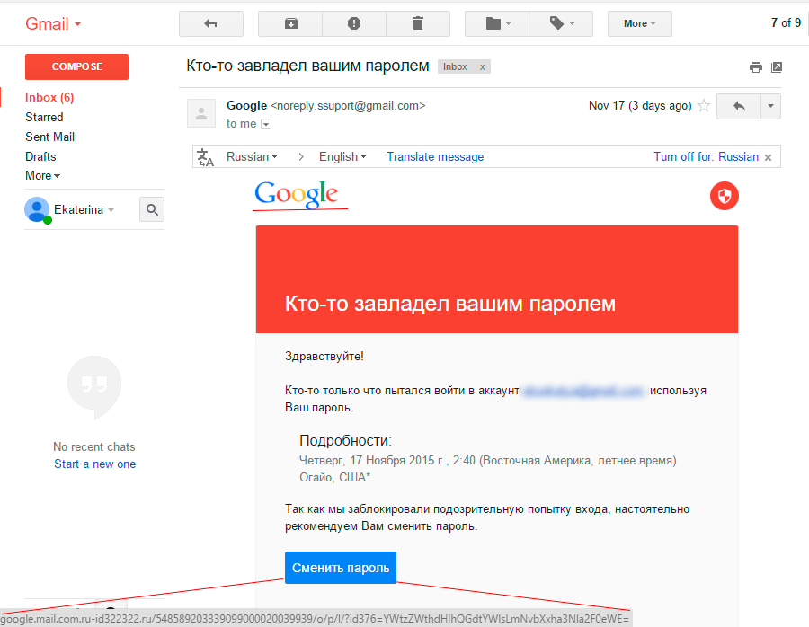
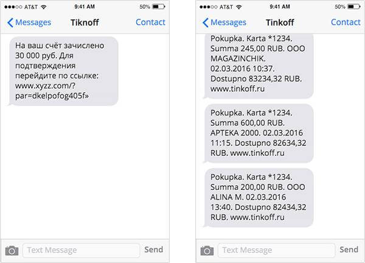
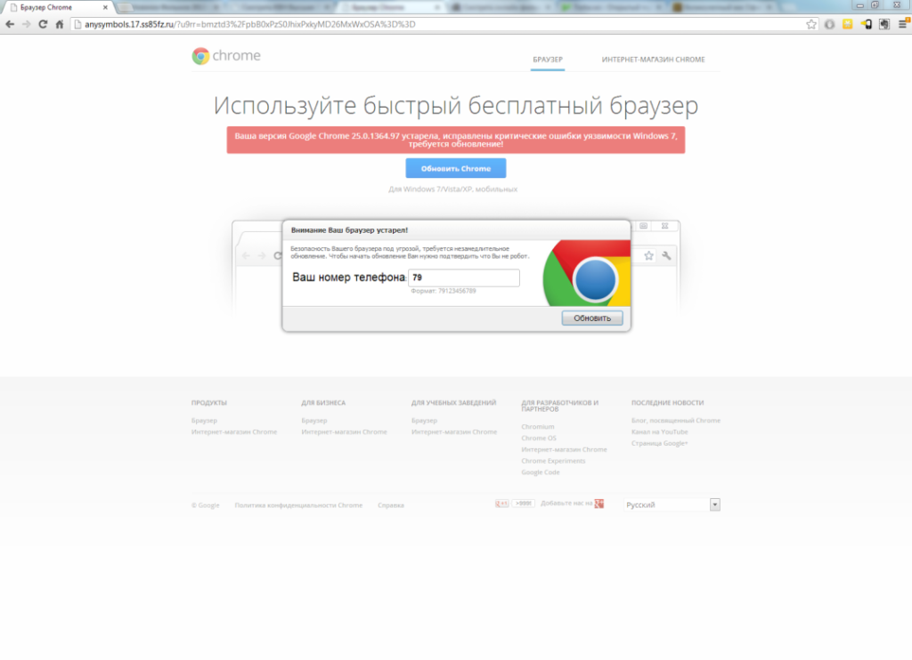
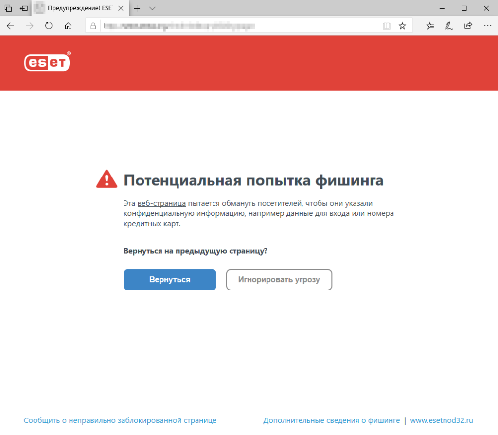
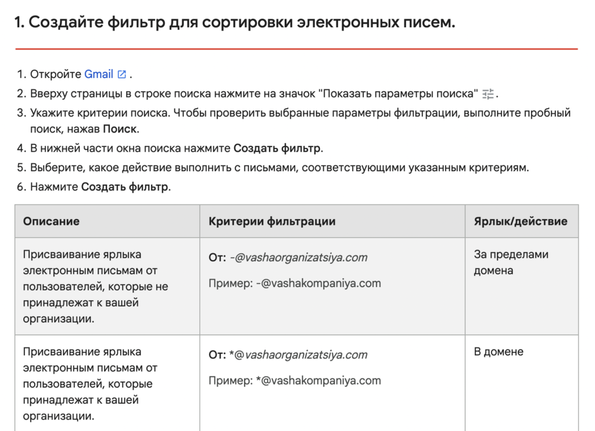
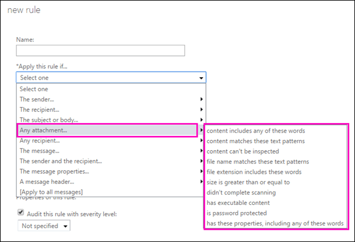

# Подготовка воспроизводимых отчетов


# Фишинг

**Фишинг** — это распространенный способ интернет-мошенничества. Хакеры
используют его, чтобы получить доступ к конфиденциальной информации
других людей: их учетным записям и данным банковских карт.

Фишинговые мошенники действуют по отработанной схеме: закидывают
«наживку» — письмо, сообщение, ссылку на сайт — и пытаются «поймать»
доверчивых пользователей. Поэтому неудивительно, что сам термин
произошел от англоязычного phishing, которое созвучно со словом fishing
— «рыбалка». Замена f на ph — отсылка к оригинальной форме хакерства
фрикингу, или телефонному взлому (phreaking).

Фишинг становится популярнее с каждым годом. По статистике Google, в
2021 году компания обнаружила более 2 миллионов фишинговых сайтов — это
на 27% больше, чем в 2020 году.

## Виды фишинговых атак

### Почтовый фишинг

Злоумышленники отправляют пользователям письма под видом известного
бренда: подделывают адрес, чтобы он напоминал официальный. Получатель
нажимает на ссылку и переходит на поддельный сайт или загружает документ
с вирусом.

Одна из вариаций почтового фишинга — **клон-фишинг**. Мошенники
определяют, какими программами и магазинами вы часто пользуетесь, а
затем отправляют письма якобы от этих брендов.



<sup>*Пример фишингового письма, замаскированного под письмо от службы безопасности Gmail. При наведении на кнопку «Сменить пароль» отображается фишинговая ссылка.*</sup>

### Целевой фишинг

Его еще называют **спеар-фишинг** (spear phishing). Мошенники
нацеливаются на конкретную компанию, изучают нескольких сотрудников по
аккаунтам в соцсетях или информации на сайте.

Затем этим сотрудникам отправляют письма будто бы от коллег: используют
реальные имена, должности, номера рабочих телефонов. Человек думает, что
получил внутренний запрос, и следует указаниями из письма.

В 2020 году американская медицинская компания Elara Caring неделю
останавливала утечку данных клиентов, после того как злоумышленники
получили доступ к аккаунтам сотрудников и стали рассылать с них
фишинговые сообщения. В результате атаки мошенники украли информацию о
ста тысячах пациентов: имена, даты рождения, банковские данные, номера
водительских прав и социального страхования.

У спеар-фишинга есть подвид — **уэйлинг**. Слово происходит от whailing
— «охота на китов». Это целевой фишинг, который направлен на
руководителей.

### Телефонный фишинг

Этот тип атаки разделяется на два подвида: вишинг и смишинг.

**Голосовой фишинг**, или вишинг (vishing) предполагает разговор по
телефону. Преступник звонит жертве, давит на нее и создает повышенное
чувство срочности, чтобы человек сообщил конфиденциальные данные.

Мошенники часто представляются сотрудниками банков: они сообщают о
заявках на кредит или подозрительных переводах, угрожают блокировкой, а
затем требуют сообщить смс-код или оформить подозрительный перевод.

В результате люди теряют все свои накопления. Так, в 2020 году с помощью
голосового фишинга мошенники украли у одной женщины 400 миллионов
рублей.

В **смишинге** (smishing) вместо звонков используют СМС-сообщения с
вредоносными ссылками, которые маскируют под купоны и розыгрыши.

<sup>*Пример фишингового сообщения: справа переписка с настоящим банком, слева — с мошенниками, которые переставили буквы в названии банка местами.*</sup>

### CEO-мошенничество

Через социальные сети или веб-сайты мошенники находят информацию о
руководстве компании, например о генеральном директоре или главном
бухгалтере. Затем подделывают почтовый ящик и рассылают письма другим
сотрудникам от имени этого руководителя.

Яркий случай СЕО-мошенничества произошел в 2015 году, когда финансовый
отдел австрийско-китайской аэрокосмической компании FACC перевел
злоумышленникам 61 миллион долларов, следуя указаниям из поддельного
письма от гендиректора.

### Фишинг в социальных сетях

Такие мошенники создают поддельные аккаунты в *Instagram, ВКонтакте,
Facebook, Twitter*. Хакеры выдают себя за знакомого жертвы или аккаунт
известной компании. Они присылают сообщения со ссылками на поддельные
сайты, запрашивают личную информацию через Facebook\*-приложения,
отмечают на изображениях с призывом перейти на сайт.

Смежный способ фишинга — мошенничество в мессенджерах: Telegram,
WhatsApp и Viber. Через них хакеры рассылают сообщения якобы от
популярных компаний в попытке завладеть вашими личными данными.

Один из крупных примеров — мошенничество, направленное на пользователей
Booking.com. В 2018 году хакеры рассылали юзерам WhatsApp-сообщения,
через которые получали доступ к аккаунтам. Завладев информацией о
бронированиях, злоумышленники требовали оплатить проживание по
поддельным счетам.

Компания не говорит, сколько денег потеряли клиенты, но, по данным CNN,
от подобных типов мошенничества только за первый квартал 2021 года
американцы потеряли 26 миллионов долларов.

### Веб-фишинг

Главный метод этого вида — \*подмена сайта. Хакер создает страницу,
практически не отличимую от сайта крупного бренда или компании, в
которой вы работаете. Вы используете свою учетную запись для входа, и
злоумышленник получает доступ к реальному аккаунту.

<sup>*Пример фишингового сайта, замаскированного под страницу обновления Google Chrome. Адрес страницы не имеет никакого отношения к браузеру.*</sup>

Хакеры либо присылают ссылку через email, либо перенаправляют
пользователей на поддельный сайт при помощи **фарминга**. Злоумышленники
взламывают систему доменных имен (DNS), и когда пользователь хочет зайти
на сайт, сервер открывает страницу-подделку.

У веб-фишинга много вариаций.

-   Фишинг через поисковые системы. Такие мошенники таргетируются на
    людей, желающих что-то купить: их просят ввести конфиденциальную
    информацию, которую перехватывает хакер.
-   «Атака на водопое». Хакеры выясняют, какие сайты часто посещают
    сотрудники компании, и подменяют адрес или добавляют к нему
    вредоносный код для скачивания.
-   Всплывающие окна или уведомления веб-браузера. Когда человек кликает
    на кнопку «разрешить», на устройство загружается вредоносный код.

### Злой двойник

Фишинговая атака evil twin симулирует привычную точку доступа Wi-Fi.
После подключения злоумышленники получают учетные данные для входа в
систему и другую информацию.

В 2020 году хакеры при помощи такого способа и оборудования стоимостью
200 долларов взломали сети Министерства внутренних дел США. К счастью,
хакеры оказались «белыми», то есть этичными. Они работали на управление
генерального инспектора МВД и помогали надзорному ведомству устранить
уязвимости в системе безопасности.

## Как распознать фишинг-атаки и не попасться на удочку

### Обучайтесь сами и обучайте сотрудников.

Вот список подозрительных «флажков», которые указывают на фишинговое
письмо:

-   Письмо создает иллюзию срочности и вызывает тревогу.
-   Письмо обезличено, к отправителю не обращаются по имени (этот пункт
    может не соблюдаться при использовании целевого фишинга).
-   В письме есть грамматические и орфографические ошибки.
-   Письмо пришло от подразделения или от сотрудника, который прежде с
    вами не общался, либо в письме содержится нехарактерная просьба.
-   К письму прикреплен zip-файл или большое изображение.
-   Адрес почты вызывает подозрения. Например, организация использует
    адреса в виде <a href="mailto:name@example.com"
    class="email"><em>name@example.com</em></a>, а письмо пришло с
    адреса <a href="mailto:name.example@gmail.com"
    class="email"><em>name.example@gmail.com</em></a>. Либо в имени
    сотрудника есть опечатки.
-   Ссылки встроены в текст или сокращены, либо при наведении на ссылку
    отображается другой адрес.
-   Отправитель пишет с личной электронной почты вместо рабочей.

А вот как определить фишинговый сайт:

-   Веб-адрес написан с ошибками: например: *appel.com* вместо
    *apple.com*.
-   В адресе сайта стоит http вместо https.
-   У адреса неправильный домен верхнего уровня: например, .org вместо
    .ru.
-   Логотип компании плохого качества.
-   Браузер предупреждает, что сайт небезопасный.

### Подключите двухфакторную аутентификацию.

Двухфакторная аутентификация, помимо пароля, обычно требует:

-   ввести код, который пришел на почту, в смс или в push-уведомлении;
-   подтвердить вход на другом устройстве;
-   подтвердить вход через биометрические данные — отпечаток пальца или
    сканирование лица.

Так как злоумышленники чаще всего охотятся за логинами и паролями, такая
защита личных и рабочих аккаунтов пресечет многие попытки украсть
данные.

### Регулярно обновляйте софт.

Злоумышленники часто используют уязвимости программного обеспечения.
Чтобы избежать проблем, регулярно устанавливайте обновления, которые
устраняют эти недостатки.

### Установите надежный антивирус.

Антивирусные программы сегодня не только сканируют загружаемые программы
на предмет вредоносных кодов, но и могут определять фишинговые сайты.

<sup>*Nod32 предупреждает, что вы пытаетесь зайти на фишинговый сайт*</sup>

### Подключите почтовые фильтры. Фишинговые мошенники часто делают массовые рассылки, поэтому хороший почтовый фильтр пометит их как спам-рассылку.

Кроме того, киберпреступники часто прячут вредоносный код в активном
содержимом PDF-файла или в коде — вы можете настроить почтовый клиент
или антивирус так, чтобы сервис проверял такие вложения.

У разных почтовых клиентов фильтры настраиваются по-разному. Например, в
почте Gmail можно помечать подозрительные письма ярлыками или сразу
удалять их, а в Microsoft Exchange Online — основательно проверять
вложения.

Чаще всего отрегулировать почтовые фильтры можно в настройках почтовых
клиентов в разделах «Фильтры» или «Правила».


<sup>*Пример фильтров, которые можно настроить в Gmail*</sup>


<sup>*Пример настройки правил для вложений в Microsoft Exchange Online*</sup>

``` r
print('Hello World!')
```

    [1] "Hello World!"

Это программный код!
