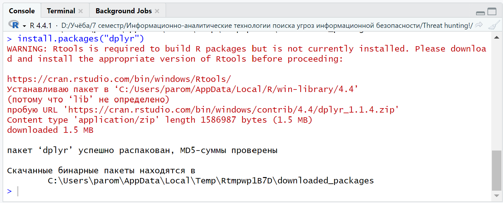

# Основы обработки данных с помощью R и Dplyr


## Цель работы:

-   Развить практические навыки использования языка программирования R
    для обработки данных.

-   Закрепить знания базовых типов данных языка R.

-   Развить практические навыки использования функций обработки данных
    пакета dplyr функции select(), filter(), mutate(), arrange(),
    group_by().

## Решение задачи:

Для того чтобы начать выполнение задание необходимо загрузить пакет
Dplyr:

<figure>

<figcaption aria-hidden="true">А затем подключим его:</figcaption>
</figure>

``` r
library("dplyr")
```


    Присоединяю пакет: 'dplyr'

    Следующие объекты скрыты от 'package:stats':

        filter, lag

    Следующие объекты скрыты от 'package:base':

        intersect, setdiff, setequal, union

### Шаг №1:

Сколько строк в датафрейме?

``` r
starwars %>% nrow()
```

    [1] 87

### Шаг №2:

Сколько столбцов в датафрейме?

``` r
starwars %>% ncol()
```

    [1] 14

### Шаг №3:

Как просмотреть примерный вид датафрейма?

``` r
starwars %>% glimpse()
```

    Rows: 87
    Columns: 14
    $ name       <chr> "Luke Skywalker", "C-3PO", "R2-D2", "Darth Vader", "Leia Or…
    $ height     <int> 172, 167, 96, 202, 150, 178, 165, 97, 183, 182, 188, 180, 2…
    $ mass       <dbl> 77.0, 75.0, 32.0, 136.0, 49.0, 120.0, 75.0, 32.0, 84.0, 77.…
    $ hair_color <chr> "blond", NA, NA, "none", "brown", "brown, grey", "brown", N…
    $ skin_color <chr> "fair", "gold", "white, blue", "white", "light", "light", "…
    $ eye_color  <chr> "blue", "yellow", "red", "yellow", "brown", "blue", "blue",…
    $ birth_year <dbl> 19.0, 112.0, 33.0, 41.9, 19.0, 52.0, 47.0, NA, 24.0, 57.0, …
    $ sex        <chr> "male", "none", "none", "male", "female", "male", "female",…
    $ gender     <chr> "masculine", "masculine", "masculine", "masculine", "femini…
    $ homeworld  <chr> "Tatooine", "Tatooine", "Naboo", "Tatooine", "Alderaan", "T…
    $ species    <chr> "Human", "Droid", "Droid", "Human", "Human", "Human", "Huma…
    $ films      <list> <"A New Hope", "The Empire Strikes Back", "Return of the J…
    $ vehicles   <list> <"Snowspeeder", "Imperial Speeder Bike">, <>, <>, <>, "Imp…
    $ starships  <list> <"X-wing", "Imperial shuttle">, <>, <>, "TIE Advanced x1",…

### Шаг №4:

Сколько уникальных рас персонажей (species) представлено в данных?

``` r
starwars %>% select(species) %>% filter(!is.na(species)) %>% n_distinct()
```

    [1] 37

### Шаг №5:

Найти самого высокого персонажа.

``` r
starwars %>% arrange(desc(height)) %>% head(1) %>% select(name)
```

    # A tibble: 1 × 1
      name       
      <chr>      
    1 Yarael Poof
