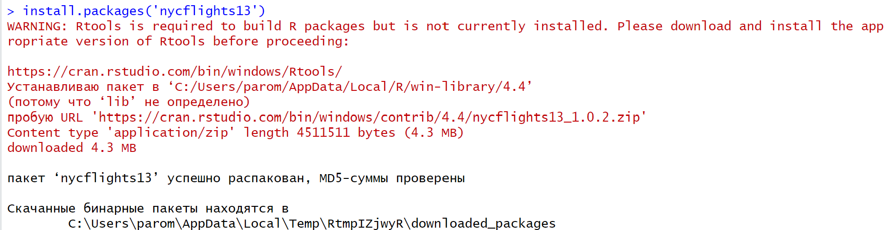

# Основы обработки данных с помощью R и Dplyr №2


## Цель работы:

-   Развить практические навыки использования языка программирования R
    для обработки данных

-   Закрепить знания базовых типов данных языка R

-   Развить практические навыки использования функций обработки данных
    пакета dplyr – функции select(), filter(), mutate(), arrange(),
    group_by()

## Исходные данные

1.  OC Windows

2.  Ноутбук

3.  Пакет nycflights13

4.  RStudio

## Общий план выполнения работы

1.  Установить библиотеку nycflights13.

2.  Проанализировать встроенные в пакет nycflights13 наборы данных с
    помощью языка R и ответить на вопросы:

    -   Сколько встроенных в пакет nycflights13 датафреймов?

    -   Сколько строк в каждом датафрейме?

    -   Сколько столбцов в каждом датафрейме?

    -   Как просмотреть примерный вид датафрейма?

    -   Сколько компаний-перевозчиков (carrier) учитывают эти наборы
        данных (представлено в наборах данных)?

    -   Сколько рейсов принял аэропорт John F Kennedy Intl в мае?

    -   Какой самый северный аэропорт?

    -   Какой аэропорт самый высокогорный (находится выше всех над
        уровнем моря)?

    -   Какие бортовые номера у самых старых самолетов?

    -   Какая средняя температура воздуха была в сентябре в аэропорту
        John F Kennedy Intl (в градусах Цельсия).

    -   Самолеты какой авиакомпании совершили больше всего вылетов в
        июне?

    -   Самолеты какой авиакомпании задерживались чаще других в 2013
        году?

3.  Оформить отчет в соответствии с шаблоном

## Содержание ЛР

### Шаг 1: Получение данных

Установим пакет nycflights13:



Подключим пакеты:

``` r
library(dplyr)
```

    Warning: пакет 'dplyr' был собран под R версии 4.4.2


    Присоединяю пакет: 'dplyr'

    Следующие объекты скрыты от 'package:stats':

        filter, lag

    Следующие объекты скрыты от 'package:base':

        intersect, setdiff, setequal, union

``` r
library(nycflights13)
```

    Warning: пакет 'nycflights13' был собран под R версии 4.4.2

### Шаг 2: Ответы на вопросы

-   Сколько встроенных в пакет nycflights13 датафреймов?

``` r
ls("package:nycflights13") %>% length()
```

    [1] 5

-   Сколько строк в каждом датафрейме?

``` r
list(
  flights = nrow(flights),
  airlines = nrow(airlines),
  airports = nrow(airports),
  planes = nrow(planes),
  weather = nrow(weather))
```

    $flights
    [1] 336776

    $airlines
    [1] 16

    $airports
    [1] 1458

    $planes
    [1] 3322

    $weather
    [1] 26115

-   Сколько столбцов в каждом датафрейме?

``` r
list(
  flights = ncol(flights),
  airlines = ncol(airlines),
  airports = ncol(airports),
  planes = ncol(planes),
  weather = ncol(weather))
```

    $flights
    [1] 19

    $airlines
    [1] 2

    $airports
    [1] 8

    $planes
    [1] 9

    $weather
    [1] 15

-   Как просмотреть примерный вид датафрейма?

``` r
planes %>% glimpse()
```

    Rows: 3,322
    Columns: 9
    $ tailnum      <chr> "N10156", "N102UW", "N103US", "N104UW", "N10575", "N105UW…
    $ year         <int> 2004, 1998, 1999, 1999, 2002, 1999, 1999, 1999, 1999, 199…
    $ type         <chr> "Fixed wing multi engine", "Fixed wing multi engine", "Fi…
    $ manufacturer <chr> "EMBRAER", "AIRBUS INDUSTRIE", "AIRBUS INDUSTRIE", "AIRBU…
    $ model        <chr> "EMB-145XR", "A320-214", "A320-214", "A320-214", "EMB-145…
    $ engines      <int> 2, 2, 2, 2, 2, 2, 2, 2, 2, 2, 2, 2, 2, 2, 2, 2, 2, 2, 2, …
    $ seats        <int> 55, 182, 182, 182, 55, 182, 182, 182, 182, 182, 55, 55, 5…
    $ speed        <int> NA, NA, NA, NA, NA, NA, NA, NA, NA, NA, NA, NA, NA, NA, N…
    $ engine       <chr> "Turbo-fan", "Turbo-fan", "Turbo-fan", "Turbo-fan", "Turb…

-   Сколько компаний-перевозчиков (carrier) учитывают эти наборы данных
    (представлено в наборах данных)?

``` r
airlines %>%
  select(carrier) %>%
  unique() %>%
  filter(!is.na(carrier)) %>%
  nrow()
```

    [1] 16

-   Сколько рейсов принял аэропорт John F Kennedy Intl в мае?

``` r
flights %>% filter(origin == "JFK", month == 5) %>% nrow()
```

    [1] 9397

-   Какой самый северный аэропорт?

``` r
airports %>% arrange(desc(lon)) %>% slice(1)
```

    # A tibble: 1 × 8
      faa   name           lat   lon   alt    tz dst   tzone            
      <chr> <chr>        <dbl> <dbl> <dbl> <dbl> <chr> <chr>            
    1 SYA   Eareckson As  52.7  174.    98    -9 A     America/Anchorage

## Оценка результата

Были использованы знания
функций `select(), filter(), mutate(), arrange(), group_by()` для
решения практических задач.

## Вывод

В результате выполнения работы были:

-   развиты практические навыки использования языка программирования R
    для обработки данных

-   закреплены знания базовых типов данных языка R

-   развиты практические навыки использования функций обработки данных
    пакета `dplyr` – функции
    `select(), filter(), mutate(), arrange(), group_by()`
