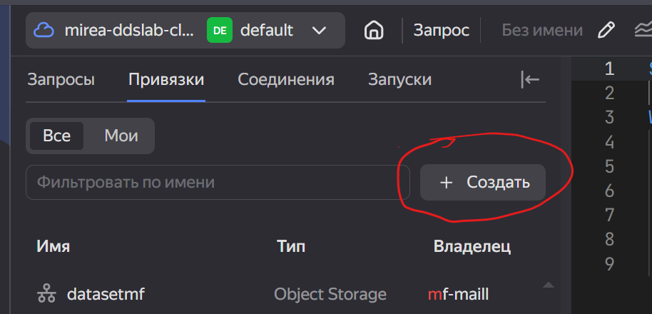
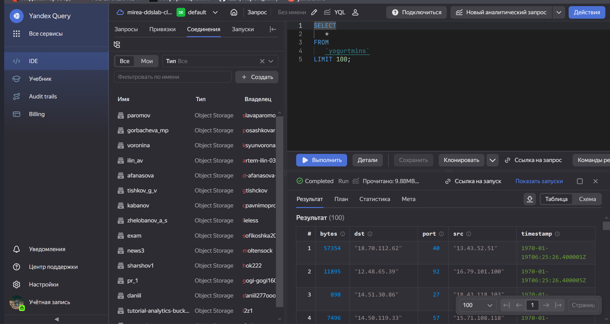
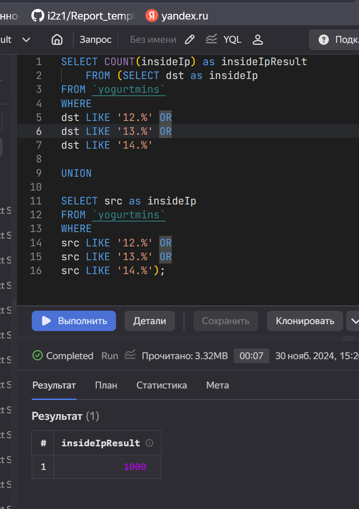
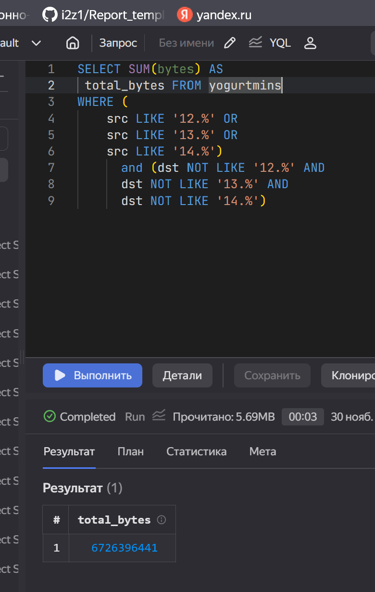
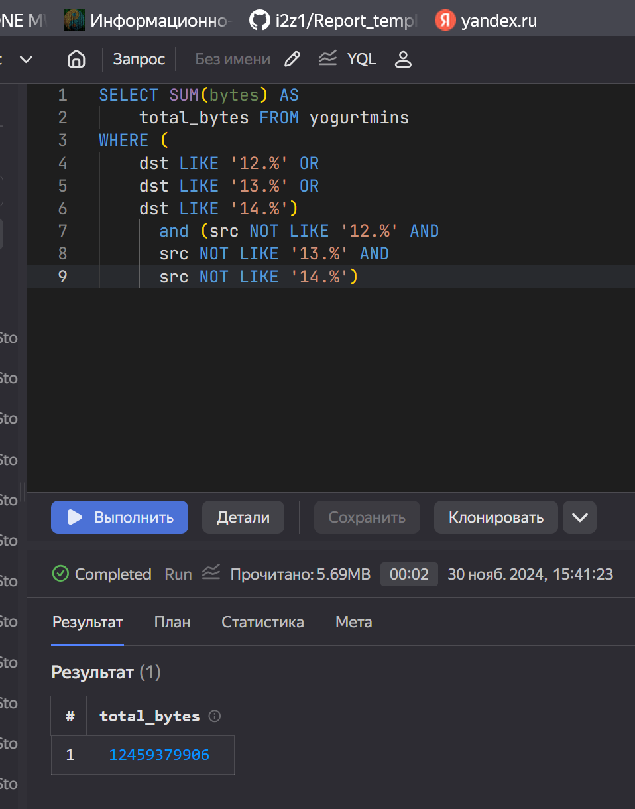

# Использование технологии Yandex Query для анализа данных сетевой активности

## Цель работы:

-   Изучить возможности технологии Yandex Query для анализа
    структурированных наборов данных

-   Получить навыки построения аналитического пайплайна для анализа
    данных с помощью сервисов Yandex Cloud

-   Закрепить практические навыки использования SQL для анализа данных
    сетевой активности в сегментированной корпоративной сети

## Исходные данные

1.  Ноутбук c Windows и установленным Git, R и RStudio

2.  Доступ к Yandex Query

## Общий план выполнения работы

1.  Проверить доступность данных в Yandex Object Storage

2.  Подключить бакет как источник данных для Yandex Query

3.  Анализ. Решение следующих заданий:

    -   Известно, что IP адреса внутренней сети начинаются с октетов,
        принадлежащих интервалу $$12-14$$. Определите количество хостов
        внутренней сети, представленных в датасете.

    -   Определите суммарный объем исходящего трафика

    -   Определите суммарный объем входящего трафика

4.  Оформить отчет в соответствии с шаблоном

## Содержание ЛР

### Шаг №1

Данные в Yandex Object Storage доступны по следующем ссылке:
<https://storage.yandexcloud.net/arrow-datasets>


### Шаг №2

Подключаем бакет как источник данных для Yandex Query:

-   Создаём соединение для бакета в S3 хранилище


-   Заполняем поля с учетом допустимых символов, выбираем тип
    аутентификации (все же помнят что это такое!) – публичный. Вводим
    имя бакета в соответствующее поле и сохраняем.


-   Теперь, после создания соединения, укажем какой объект использовать
    в качестве источника данных. Для этого нужно сделать привязку
    данных.



-   Начинаем самый ответственный этап – настройку привязки данных!


-   Проверим подключение и привязку к базе:



### Шаг №3

Задания:

1.  Известно, что IP адреса внутренней сети начинаются с октетов,
    принадлежащих интервалу ‘12-14’. Определите количество хостов
    внутренней сети, представленных в датасете.



``` r
resultInsideIp <- 1000;
resultInsideIp
```

```         
[1] 1000
```

2\. Определите суммарный объем исходящего трафика



``` r
traficIshod <- 6726396441;
traficIshod
```

```         
[1] 6726396441
```

3\. Определите суммарный объем входящего трафика



``` r
traficVhod <- 12459379906;
traficVhod
```

```         
[1] 12459379906
```

## Оценка результата

В результате работы была скачан пакет nycflights13 и были выполнены
задания с использованием наборов данных.

## Вывод

В результате выполненной работы был скачан пакет nycflights13 и были
выполнены задания с использованием наборов данных.
