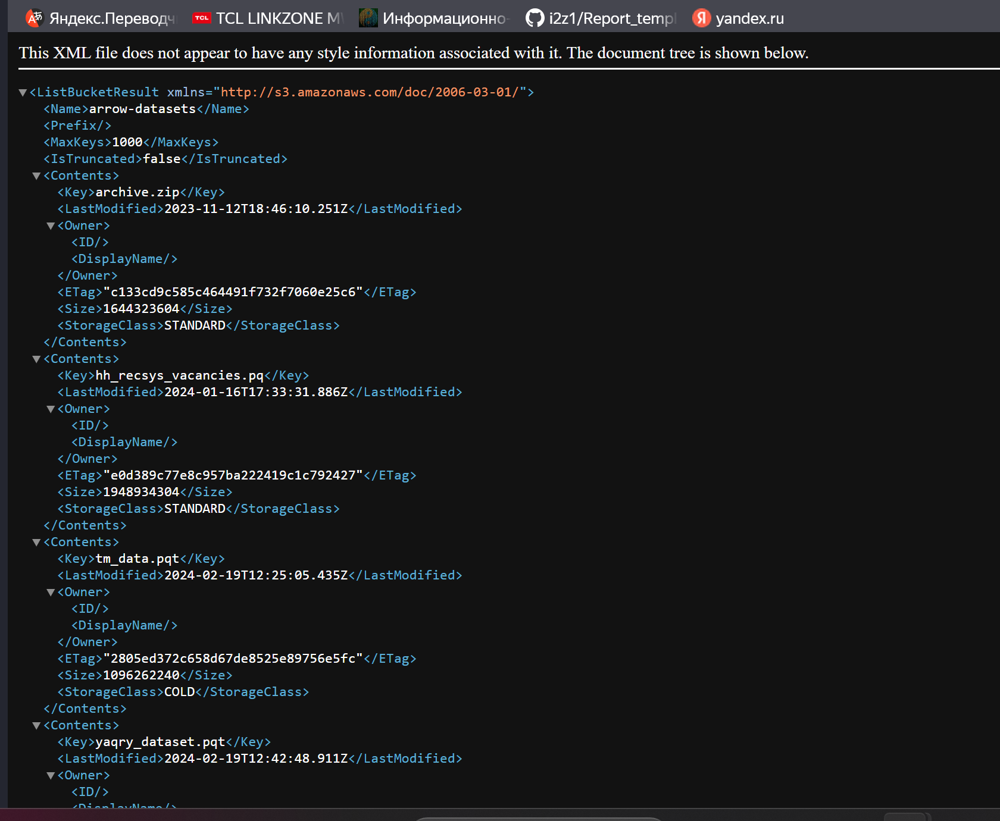
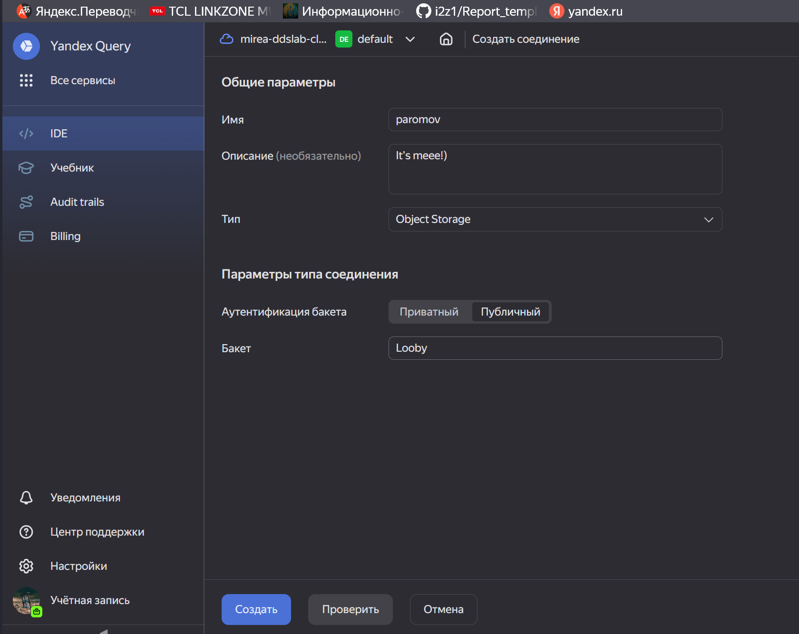
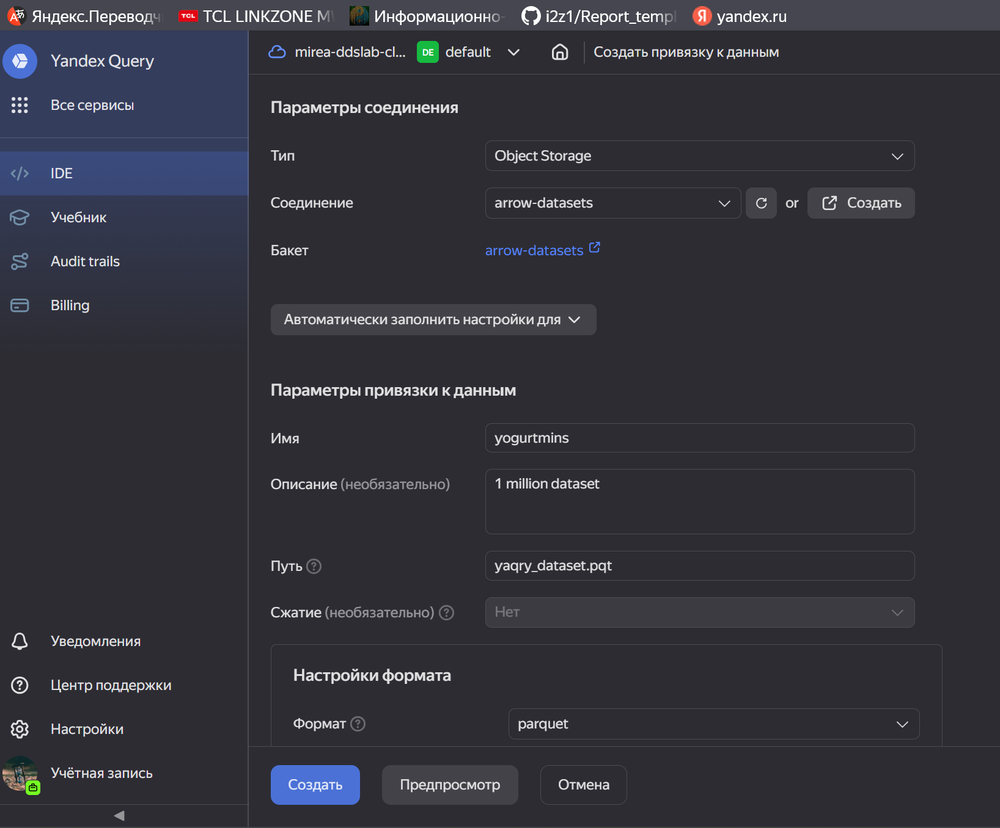
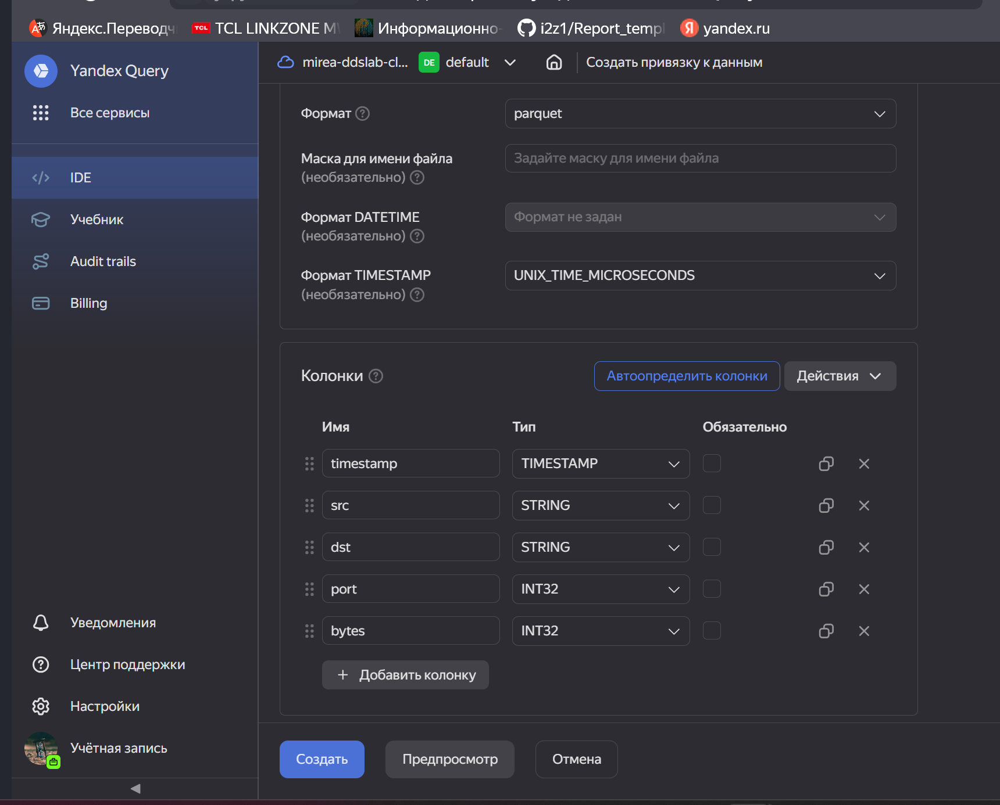

# Основы обработки данных с помощью R и Dplyr №2

## Цель работы:

-   Изучить возможности технологии Yandex Query для анализа
    структурированных наборов данных

-   Получить навыки построения аналитического пайплайна для анализа
    данных с помощью сервисов Yandex Cloud

-   Закрепить практические навыки использования SQL для анализа данных
    сетевой активности в сегментированной корпоративной сети

## Исходные данные

1.  Ноутбук c Windows и установленным Git, R и RStudio

2.  Доступ к Yandex Query

## Общий план выполнения работы

1.  Проверить доступность данных в Yandex Object Storage

2.  Подключить бакет как источник данных для Yandex Query

3.  Анализ. Решение следующих заданий:

    -   Известно, что IP адреса внутренней сети начинаются с октетов,
        принадлежащих интервалу \[12-14\]. Определите количество хостов
        внутренней сети, представленных в датасете.

    -   Определите суммарный объем исходящего трафика

    -   Определите суммарный объем входящего трафика

4.  Оформить отчет в соответствии с шаблоном

## Содержание ЛР

### Шаг 1

Данные в Yandex Object Storage доступны по следующем ссылке:
<https://storage.yandexcloud.net/arrow-datasets>

## Оценка результата

В результате работы была скачан пакет nycflights13 и были выполнены
задания с использованием наборов данных.

## Вывод

В результате выполненной работы был скачан пакет nycflights13 и были
выполнены задания с использованием наборов данных.
