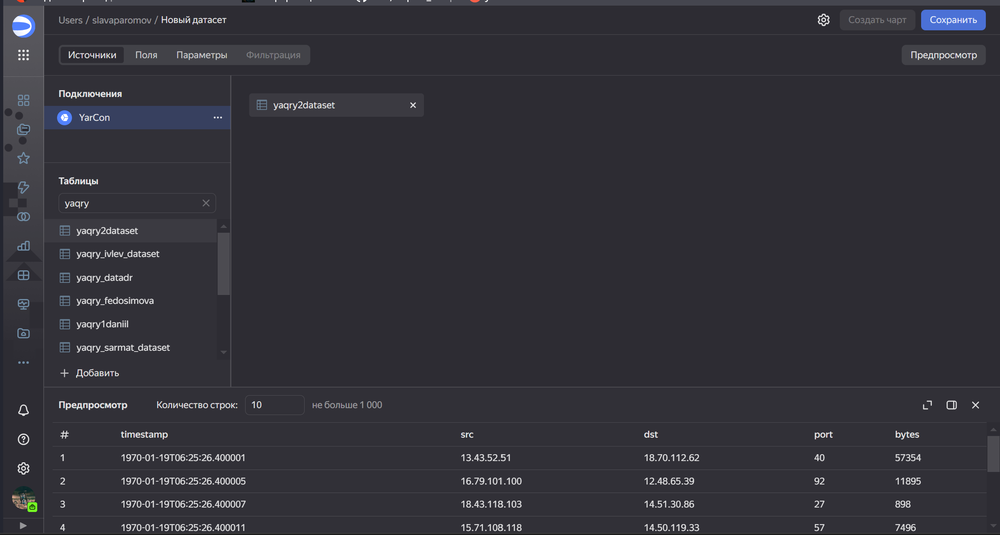
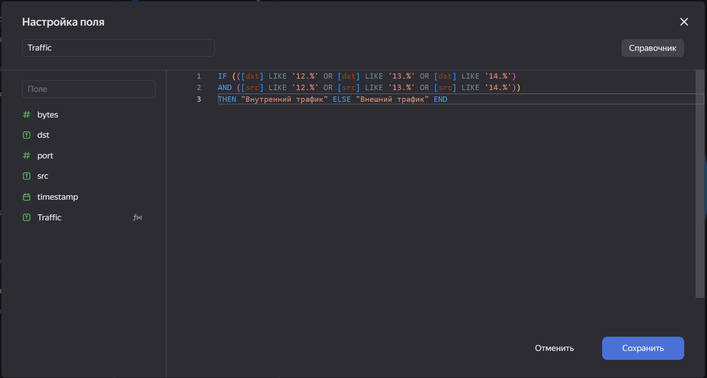
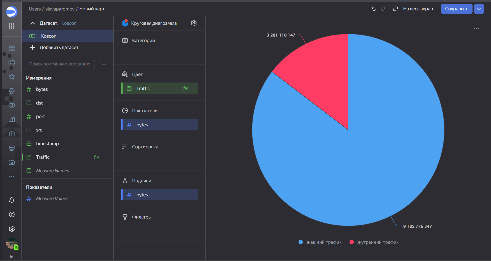
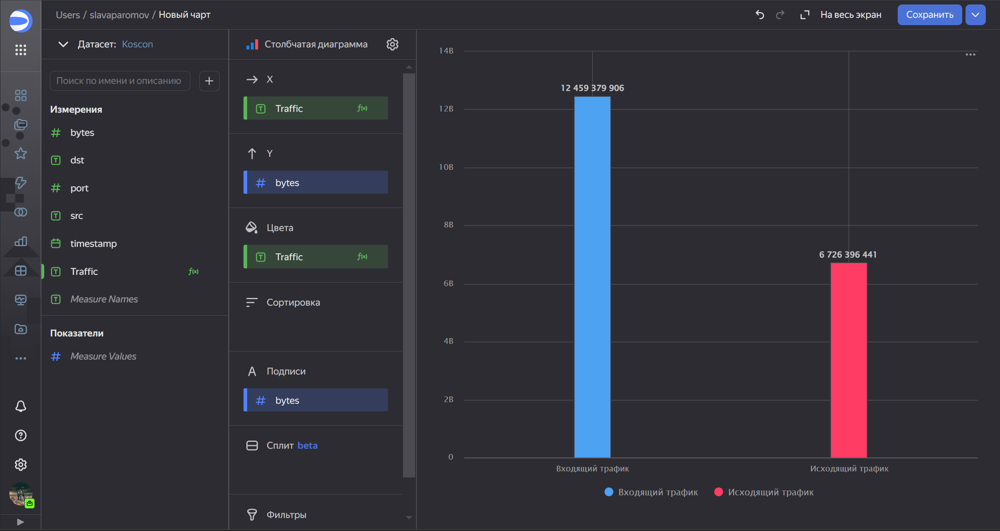
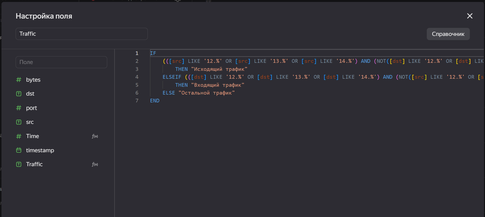
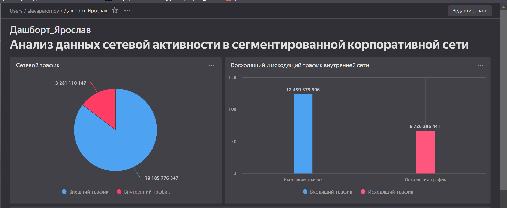
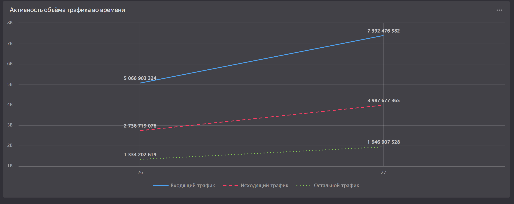

# Использование технологии Yandex DataLens для анализа данных сетевой
активности


## Цель работы:

1.  Изучить возможности технологии Yandex DataLens для визуального
    анализа структурированных наборов данных

2.  Получить навыки визуализации данных для последующего анализа с
    помощью сервисов Yandex Cloud

3.  Получить навыки создания решений мониторинга/SIEM на базе облачных
    продуктов и открытых программных решений

4.  Закрепить практические навыки использования SQL для анализа данных
    сетевой активности в сегментированной корпоративной сети

## Исходные данные

1.  Персональный компьютер

2.  Браузер

3.  R studio

4.  Yandex DataLens

5.  Yandex Cloud

## Общий план выполнения работы

1.  Настроить подключение к Yandex Query из DataLens

2.  Создать из запроса YandexQuery датасет DataLens

3.  Выполнение заданий

4.  Подготовить отчёт

## Содержание ЛР

### Шаг 1. Настройка Yandex Query и подключение данных в Yandex Object Storage

Настройка и подключение к общей организации Yandex Query выполенена на
основе методичкеских указаний и представлена в отчете по практической
работе №4.

``` r
print("Yandex Query is configured")
```

    [1] "Yandex Query is configured"

### Шаг 2. Настроить подключение к Yandex Query из DataLens

Создано и настроено новое подключение датасета к Yandex Query из
DataLens.


### Шаг 3

На данном этапе происходит создание из запроса YandexQuery датасет
DataLens.



### Шаг 4. Решение аналитических задач

-   Представлено в виде круговой диаграммы соотношение внешнего и
    внутреннего сетевого трафик






В параметре Traffic представлена следующая функция на языке SQL:

``` r
#IF (([dst] LIKE '12.%' OR [dst] LIKE '13.%' OR [dst] LIKE '14.%') AND ([src] LIKE '12.%' OR [src] LIKE '13.%' OR [src] LIKE '14.%')) THEN "Внутренний трафик" ELSE "Внешний трафик" END
```

В параметре ПОКАЗАТЕЛИ и ПОДПИСИ представлено количество байт
передаваемого трафика.

-   Представлено в виде столбчатой диаграммы соотношение входящего и
    исходящего трафика из внутреннего сетвого сегмента.




В качетве параметров Y и ПОДПИСИ выбрано количество байт передаваемоего
трафика, а в качетве пареметров X и ЦВЕТА представлена следующая функция
на языке SQL:

``` r
#IF (([src] LIKE '12.%' OR [src] LIKE '13.%' OR [src] LIKE '14.%') AND (NOT([dst] LIKE '12.%' OR [dst] LIKE '13.%' OR [dst] LIKE '14.%'))) THEN "Исходящий трафик" ELSEIF (([dst] LIKE '12.%' OR [dst] LIKE '13.%' OR [dst] LIKE '14.%') AND (NOT([src] LIKE '12.%' OR [src] LIKE '13.%' OR [src] LIKE '14.%'))) THEN "Входящий трафик" END
```

-   Построен график активности (линейная диаграмма) объема трафика во
    времени.





В качетве параметра Y взято количество байт передаваемоего трафика, а в
качетве пареметров X и ЦВЕТА и ФОРМЫ представлена следующая функция на
языке SQL:

``` r
#IF (([src] LIKE '12.%' OR [src] LIKE '13.%' OR [src] LIKE '14.%') AND (NOT([dst] LIKE '12.%' OR [dst] LIKE '13.%' OR [dst] LIKE '14.%'))) THEN "Исходящий трафик" ELSEIF (([dst] LIKE '12.%' OR [dst] LIKE '13.%' OR [dst] LIKE '14.%') AND (NOT([src] LIKE '12.%' OR [src] LIKE '13.%' OR [src] LIKE '14.%'))) THEN "Входящий трафик" ELSE "Остальной трафик" END
```

-   Все построенные графики выведены в виде единого дашборда в Yandex
    DataLens.





Ссылка на дашборд:
<https://datalens.yandex.cloud/pbzuzhcmwx6sc-dashbort-yaroslav>

## Оценка результата

Проведен анализ сетевой активности в сегментированной корпоративной сети

## Вывод

1.  Были изучены возможности технологии Yandex DataLens для визуального
    анализа структурированных наборов данных

2.  Получены навыки визуализации данных для последующего анализа с
    помощью сервиса Yandex Cloud

3.  Получены навыки создания решений мониторинга/SIEM на базе облачных
    продуктов и открытых программных решений

4.  Закреплены на практике навыки использования SQL для анализа данных
    сетевой активности в сегментированной корпоративной сети
