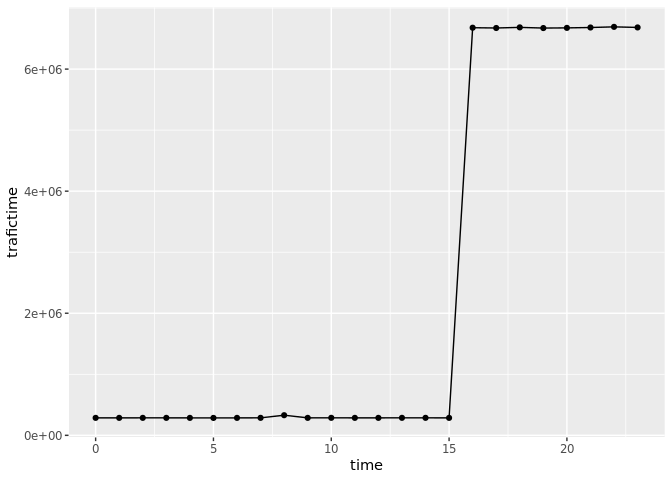

# Анализ данных сетевого трафика с использованием аналитической
in-memory СУБД DuckDB


## Цель

1.  Изучить возможности СУБД DuckDB для обработки и анализ больших
    данных

2.  Получить навыки применения DuckDB совместно с языком
    программирования R

3.  Получить навыки анализа метаинфомации о сетевом трафике

4.  Получить навыки применения облачных технологий хранения, подготовки
    и анализа данных: Yandex Object Storage, Rstudio Server.

## Исходные даннные

1.  Персональный компьютер

2.  Браузер

3.  R studio

4.  Duck DB

5.  Yandex Object Storage

6.  Github

## Общий план выполнения

1.  Импорт данных

2.  Выполнение заданий

3.  Создание отчета

## Содержание ПР

### Шаг 1. Импорт данных

**На данном шаге происходит импорт данных**

Установка duckdb:

``` r
#install.packages('duckdb', repos=c('https://duckdb.r-universe.dev', 'https://cloud.r-project.org'), INSTALL_opts = '--no-lock', dependencies = TRUE)
```

Подключение библиотек:

``` r
library(duckdb)
```

    Loading required package: DBI

``` r
library(dplyr)
```


    Attaching package: 'dplyr'

    The following objects are masked from 'package:stats':

        filter, lag

    The following objects are masked from 'package:base':

        intersect, setdiff, setequal, union

``` r
library(DBI)
```

``` r
#install.packages("ggplot2")
```

``` r
library(ggplot2)
```

Импорт файла pqt:

``` r
#download.file('https://storage.yandexcloud.net/arrow-datasets/tm_data.pqt', destfile = "tm_data.pqt")
```

Установка соединения с duckdb и создание таблица data с данными из
импортированного файла:

``` r
con <- dbConnect(duckdb::duckdb())
query <- "CREATE TABLE data AS SELECT * FROM read_parquet('tm_data.pqt');"
dbExecute(con,query)
```

    [1] 105747730

### Шаг 2. Выполнение заданий

**На данном шаге происходит выполнение заданий:**

Внутренняя сеть: ip-адреса начинаются на 12-14

Создам отдельную таблицу только с внутренним трафиком

``` r
query <- "CREATE TEMPORARY TABLE inner_traffic AS SELECT * FROM data
WHERE (data.src LIKE '12.%' OR data.src LIKE '13.%' OR data.src LIKE '14.%') 
AND NOT (data.dst LIKE '12.%' AND data.dst LIKE '13.%' AND data.dst LIKE '14.%')"
```

``` r
dbGetQuery(con, query)
```

    Warning in dbFetch(rs, n = n, ...): Should not call dbFetch() on results that
    do not come from SELECT, got CREATE

    data frame with 0 columns and 0 rows

#### Задание 1. Найдите утечку данных из Вашей сети

Важнейшие документы с результатами нашей исследовательской деятельности
в области создания вакцин скачиваются в виде больших заархивированных
дампов. Один из хостов в нашей сети используется для пересылки этой
информации – он пересылает гораздо больше информации на внешние ресурсы
в Интернете, чем остальные компьютеры нашей сети. Определите его
IP-адрес.

``` r
query <- "SELECT src FROM inner_traffic
GROUP BY src
order by sum(bytes) desc
limit 1"
```

``` r
dbGetQuery(con, query)
```

               src
    1 13.37.84.125

#### Задание 2. Найдите утечку данных 2

Другой атакующий установил автоматическую задачу в системном
планировщике cron для экспорта содержимого внутренней wiki системы. Эта
система генерирует большое количество трафика в нерабочие часы, больше
чем остальные хосты. Определите IP этой системы. Известно, что ее IP
адрес отличается от нарушителя из предыдущей задачи.

Для начала необходимо определить какие часы являются нерабочими:

``` r
query <- "SELECT time,
    COUNT(*) AS trafictime
FROM (
    SELECT 
        timestamp,
        src,
        dst,
        bytes,
        EXTRACT(HOUR FROM epoch_ms(CAST(timestamp AS BIGINT))) AS time
    FROM inner_traffic
) sub
WHERE time BETWEEN 0 AND 24
GROUP BY time
ORDER BY time DESC;"
```

``` r
ggplot(data = dbGetQuery(con, query), aes(x = time, y = trafictime)) + 
  geom_line() +
  geom_point()
```



``` r
dbGetQuery(con, query)
```

       time trafictime
    1    23    6682193
    2    22    6691629
    3    21    6681051
    4    20    6674947
    5    19    6671974
    6    18    6683120
    7    17    6673070
    8    16    6677672
    9    15     285796
    10   14     286501
    11   13     286577
    12   12     286106
    13   11     286067
    14   10     286769
    15    9     286106
    16    8     329605
    17    7     286439
    18    6     285868
    19    5     285290
    20    4     285854
    21    3     286237
    22    2     286288
    23    1     285979
    24    0     286086

Предполагается, что нерабочие часы находятся в интервале: 16-23, так как
в этот промежуток система генерирует много трафика, относительно другого
времени.

Поэтому составляется sql-запрос:

``` r
query <- "SELECT src, total_bytes
FROM (
    SELECT src, SUM(bytes) AS total_bytes
    FROM inner_traffic
    WHERE src != '13.37.84.125'
        AND EXTRACT(HOUR FROM epoch_ms(CAST(timestamp AS BIGINT))) BETWEEN 1 AND 15
    GROUP BY src
) AS aggregated_results
ORDER BY total_bytes DESC
LIMIT 10;
;
"
```

``` r
ggplot(dbGetQuery(con, query), aes(total_bytes, src)) + geom_col()
```


``` r
dbGetQuery(con, query)
```

               src total_bytes
    1  12.55.77.96   298669501
    2  13.42.70.40   205829110
    3  12.59.25.34   136628237
    4  12.45.94.34   131224383
    5  14.57.50.29   128462176
    6  13.39.46.94   126792073
    7  14.51.30.86   126647347
    8  12.45.45.30   124842646
    9  13.48.72.30   124581084
    10 14.57.70.39   124368210

#### Задание 3. Найдите утечку данных 3

Еще один нарушитель собирает содержимое электронной почты и отправляет в
Интернет используя порт, который обычно используется для другого типа
трафика. Атакующий пересылает большое количество информации используя
этот порт, которое нехарактерно для других хостов, использующих этот
номер порта. Определите IP этой системы. Известно, что ее IP адрес
отличается от нарушителей из предыдущих задач

Необходимо найти порт, у которого разница между максимальным потоком и
средним по порту - наибольшая^  

``` r
query <- "SELECT *
  FROM read_parquet('tm_data.pqt')
  WHERE (src LIKE '12.%' OR src LIKE '13.%' OR src LIKE '14.%') 
  AND (dst NOT LIKE '12.%' AND dst NOT LIKE '13.%' AND dst NOT LIKE '14.%') 
  AND (src NOT LIKE '13.37.84.125' AND src NOT LIKE '12.55.77.96');"
all <- dbGetQuery(con, query)
```

``` r
query <- "SELECT port, AVG(bytes) AS mean_bytes, MAX(bytes) AS max_bytes, SUM(bytes) AS sum_bytes, MAX(bytes) - AVG(bytes) AS Raz
FROM inner_traffic
WHERE inner_traffic.src != '13.37.84.125' AND inner_traffic.src != '12.55.77.96'
GROUP BY port
HAVING MAX(bytes) - AVG(bytes) != 0
ORDER BY Raz DESC;"
```

``` r
ggplot(data = dbGetQuery(con, query), aes(x = port, y = Raz)) + geom_col()
```


``` r
head(dbGetQuery(con, query),1)
```

      port mean_bytes max_bytes   sum_bytes      Raz
    1   37   33348.49    209402 48192673159 176053.5

37 порт - подозрительный, поэтому выборка будет прозводится по 37 порту:

``` r
result <- all %>% filter(port == 37) %>% group_by(src) %>%
summarise(traffic = sum(bytes), count = n(), avg = traffic/count) %>% arrange(desc(avg))
```

``` r
ggplot(head(result, 10), aes(avg, src)) + geom_col()
```


``` r
head(result, 10)
```

    # A tibble: 10 × 4
       src            traffic count    avg
       <chr>            <int> <int>  <dbl>
     1 14.31.107.42   1288614    30 42954.
     2 14.42.60.94     511103    12 42592.
     3 13.38.62.122   3421563    85 40254.
     4 12.34.57.42   10933906   275 39760.
     5 13.40.119.70  10653816   274 38883.
     6 14.51.84.50   10568647   273 38713.
     7 14.55.27.67   13337122   347 38436.
     8 13.41.60.66   17175058   447 38423.
     9 14.40.64.30   12097290   316 38283.
    10 13.50.114.110 12383022   325 38102.

## Оценка результатов

Был произведен анализ данных сетевого трафика с использованием duckdb

## Вывод

1.  Изучены возможности СУБД DuckDB для обработки и анализ больших
    данных

2.  Полуены навыки применения DuckDB совместно с языком программирования
    R

3.  Получены навыки анализа метаинфомации о сетевом трафике

4.  Получены навыки применения облачных технологий хранения, подготовки
    и анализа данных: Yandex Object Storage, Rstudio Server.
